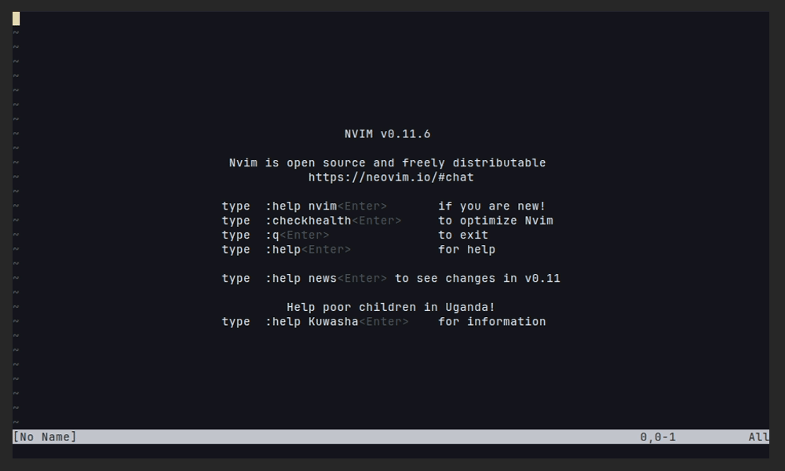

# camouflage.nvim

Hide sensitive values in configuration files during screen sharing.

A Neovim plugin that visually masks secrets in `.env`, `.json`, `.yaml`, `.toml`, `.properties`, `.netrc`, `.xml`, and `.http` files using extmarks - **without modifying the actual file content**.

[](https://github.com/zeybek/camouflage.nvim/releases)
[](https://github.com/zeybek/camouflage.nvim/actions/workflows/ci.yml)
[](https://neovim.io)
[](LICENSE)

## Demo



## Features

- **Multi-format support**: `.env`, `.json`, `.yaml`, `.yml`, `.toml`, `.properties`, `.ini`, `.conf`, `.sh`, `.netrc`, `.xml`, `.http`
- **Nested key support**: Handles `database.connection.password` in JSON/YAML/XML
- **All value types**: Masks strings, numbers, and booleans
- **Multiple styles**: `stars`, `dotted`, `text`, `scramble`
- **Reveal & Yank**: Temporarily reveal or copy masked values
- **Follow Cursor Mode**: Auto-reveal current line as you navigate
- **Have I Been Pwned**: Check passwords against breach database (Neovim 0.10+)
- **Hot Reload**: Config changes apply immediately
- **Event System**: Hooks for extending functionality
- **TreeSitter Support**: Enhanced parsing for JSON/YAML/TOML/XML/HTTP
- **Telescope/Snacks Integration**: Mask values in preview buffers
- **Zero file modification**: All masking is purely visual

## Installation

### [lazy.nvim](https://github.com/folke/lazy.nvim)

```lua
{
  'zeybek/camouflage.nvim',
  event = 'VeryLazy',
  opts = {},
  keys = {
    { '<leader>ct', '<cmd>CamouflageToggle<cr>', desc = 'Toggle Camouflage' },
    { '<leader>cr', '<cmd>CamouflageReveal<cr>', desc = 'Reveal Line' },
    { '<leader>cy', '<cmd>CamouflageYank<cr>', desc = 'Yank Value' },
    { '<leader>cf', '<cmd>CamouflageFollowCursor<cr>', desc = 'Follow Cursor' },
  },
}
```

### [packer.nvim](https://github.com/wbthomason/packer.nvim)

```lua
use {
  'zeybek/camouflage.nvim',
  config = function()
    require('camouflage').setup()
  end
}
```

## Configuration

```lua
require('camouflage').setup({
  -- General
  enabled = true,
  debug = false,               -- Enable verbose debug logging
  auto_enable = true,
  max_lines = 5000,            -- Skip files larger than this

  -- Appearance
  style = 'stars',           -- 'text' | 'dotted' | 'stars' | 'scramble'
  mask_char = '*',           -- Character for stars/dotted style
  mask_length = nil,         -- nil = actual length, number = fixed
  hidden_text = '************************',  -- For 'text' style
  highlight_group = 'Comment', -- Highlight group for masked text

  -- Custom colors (overrides highlight_group when set)
  colors = {
    foreground = '#808080',  -- Text color (hex or color name)
    background = 'transparent', -- Background ('transparent' or hex)
    bold = false,
    italic = false,
  },

  -- Parser settings
  parsers = {
    include_commented = true,      -- Include commented lines (all parsers)
    env = {
      include_export = true,       -- Include export KEY=value
    },
    json = {
      max_depth = 10,              -- Maximum nesting depth
    },
    yaml = {
      max_depth = 10,              -- Maximum nesting depth
    },
  },

  -- Integrations
  integrations = {
    telescope = true,
    cmp = {
      disable_in_masked = true,
    },
  },

  -- Reveal settings
  reveal = {
    highlight_group = 'CamouflageRevealed',  -- Highlight for revealed values
    notify = false,                           -- Show notifications
    follow_cursor = false,                    -- Auto-reveal current line
  },

  -- Yank settings
  yank = {
    default_register = '+',       -- System clipboard
    notify = true,                -- Show notification after copy
    auto_clear_seconds = 30,      -- Auto-clear clipboard (nil to disable)
    confirm = true,               -- Require confirmation before copying
  },

  -- Have I Been Pwned integration (requires Neovim 0.10+)
  pwned = {
    enabled = true,               -- Enable the feature
    auto_check = true,            -- Check on BufEnter
    check_on_save = true,         -- Check on BufWritePost
    show_sign = true,             -- Show sign column indicator
    show_virtual_text = true,     -- Show virtual text with breach count
    show_line_highlight = true,   -- Highlight the line
    sign_text = '!',              -- Sign icon
    sign_hl = 'DiagnosticWarn',   -- Sign highlight group
    virtual_text_format = 'PWNED (%s)',  -- Virtual text format
    virtual_text_hl = 'DiagnosticWarn',  -- Virtual text highlight
    line_hl = 'CamouflagePwned',  -- Line highlight group
  },

  -- Event hooks (see Events section)
  hooks = {
    on_before_decorate = function(bufnr, filename) end,
    on_variable_detected = function(bufnr, var) end,
    on_after_decorate = function(bufnr, variables) end,
  },
})
```

## Commands

| Command                     | Description                                |
| --------------------------- | ------------------------------------------ |
| `:CamouflageToggle`         | Toggle camouflage on/off                   |
| `:CamouflageRefresh`        | Refresh decorations                        |
| `:CamouflageStatus`         | Show status and masked count               |
| `:CamouflageReveal`         | Reveal masked values on current line       |
| `:CamouflageReveal!`        | Force hide revealed values                 |
| `:CamouflageYank`           | Copy unmasked value at cursor to clipboard |
| `:CamouflageYank!`          | Show picker to select value to copy        |
| `:CamouflageFollowCursor`   | Toggle follow cursor mode                  |
| `:CamouflageFollowCursor!`  | Force disable follow cursor mode           |
| `:CamouflagePwnedCheck`     | Check if value under cursor is pwned       |
| `:CamouflagePwnedCheckLine` | Check all values on current line           |
| `:CamouflagePwnedCheckBuffer` | Check all values in buffer               |
| `:CamouflagePwnedClear`     | Clear pwned indicators from buffer         |
| `:CamouflagePwnedClearCache`| Clear pwned check cache                    |

## Keymaps

Camouflage doesn't set any keymaps by default. Suggested:

```lua
vim.keymap.set('n', '<leader>ct', '<cmd>CamouflageToggle<cr>', { desc = 'Toggle Camouflage' })
vim.keymap.set('n', '<leader>cr', '<cmd>CamouflageReveal<cr>', { desc = 'Reveal Line' })
vim.keymap.set('n', '<leader>cy', '<cmd>CamouflageYank<cr>', { desc = 'Yank Value' })
vim.keymap.set('n', '<leader>cf', '<cmd>CamouflageFollowCursor<cr>', { desc = 'Follow Cursor' })
```

## Supported File Formats

| Format      | Extensions                                  | Nested Keys    |
| ----------- | ------------------------------------------- | -------------- |
| Environment | `.env`, `.env.*`, `.envrc`, `.sh`           | No             |
| JSON        | `.json`                                     | Yes            |
| YAML        | `.yaml`, `.yml`                             | Yes            |
| TOML        | `.toml`                                     | Yes (sections) |
| Properties  | `.properties`, `.ini`, `.conf`, `credentials` | Yes (sections) |
| Netrc       | `.netrc`, `_netrc`                          | No             |
| XML         | `.xml`                                      | Yes            |
| HTTP        | `.http`                                     | No             |

## Custom Patterns

For file types not supported by built-in parsers, you can define custom patterns using Lua patterns:

```lua
require('camouflage').setup({
  custom_patterns = {
    {
      file_pattern = { '*.myconfig' },  -- Glob pattern(s) for file matching
      pattern = '@([%w_]+)%s*=%s*(.+)', -- Lua pattern with capture groups
      key_capture = 1,                   -- Capture group for key (optional)
      value_capture = 2,                 -- Capture group for value (required)
    },
    {
      file_pattern = '*.secret',
      pattern = 'SECRET:%s*(.+)',
      value_capture = 1,  -- key_capture omitted, keys will be "custom_1", "custom_2", etc.
    },
  },
})
```

**Pattern Options:**

| Option | Type | Required | Description |
|--------|------|----------|-------------|
| `file_pattern` | `string\|string[]` | Yes | Glob pattern(s) for matching files |
| `pattern` | `string` | Yes | Lua pattern with capture groups |
| `key_capture` | `number` | No | Capture group number for key (auto-generated if omitted) |
| `value_capture` | `number` | Yes | Capture group number for value to mask |

**Example patterns:**

```lua
-- @variable = value
{ pattern = '@([%w_]+)%s*=%s*(.+)', key_capture = 1, value_capture = 2 }

-- SECRET: value
{ pattern = 'SECRET:%s*(.+)', value_capture = 1 }

-- $VAR=value (shell-like)
{ pattern = '%$([%w_]+)=([^%s]+)', key_capture = 1, value_capture = 2 }

-- key :: value
{ pattern = '([%w_]+)%s*::%s*(.+)', key_capture = 1, value_capture = 2 }
```

**Note:** Built-in parsers take priority over custom patterns. If a file matches a built-in parser (e.g., `.json`, `.env`), the custom pattern will not be used.

## API

```lua
local camouflage = require('camouflage')

-- Toggle
camouflage.toggle()

-- Enable/disable programmatically
camouflage.enable()
camouflage.disable()

-- Check status
camouflage.is_enabled()

-- Refresh decorations
camouflage.refresh()

-- Reveal API
camouflage.reveal.reveal_line()      -- Reveal current line
camouflage.reveal.hide()             -- Hide revealed line
camouflage.reveal.toggle()           -- Toggle reveal on current line
camouflage.reveal.is_revealed()      -- Check if any line is revealed

-- Follow Cursor Mode
camouflage.start_follow_cursor()     -- Enable follow cursor mode
camouflage.stop_follow_cursor()      -- Disable follow cursor mode
camouflage.toggle_follow_cursor()    -- Toggle follow cursor mode
camouflage.is_follow_cursor_enabled() -- Check if follow mode is active

-- Yank API
camouflage.yank.yank()               -- Yank value at cursor
camouflage.yank.yank_with_picker()   -- Show picker to select value

-- Pwned API (requires Neovim 0.10+)
camouflage.pwned_check()             -- Check value under cursor
camouflage.pwned_check_line()        -- Check all values on current line
camouflage.pwned_check_buffer()      -- Check all values in buffer
camouflage.pwned_clear()             -- Clear pwned indicators
camouflage.pwned_is_available()      -- Check if feature is available

-- Event System
camouflage.on('variable_detected', function(bufnr, var)
  -- Return false to skip masking this variable
  return var.key:match('PASSWORD')
end)
```

## Have I Been Pwned Integration

Camouflage can check your masked passwords against the [Have I Been Pwned](https://haveibeenpwned.com/) database to warn you if they've been exposed in data breaches.

> **Requires:** Neovim 0.10+, `curl`, and `sha1sum` or `openssl`

### Privacy

Uses **k-anonymity**: only the first 5 characters of the SHA-1 hash are sent to the API. Your actual passwords never leave your machine.

### Usage

```vim
:CamouflagePwnedCheck        " Check password under cursor
:CamouflagePwnedCheckLine    " Check all on current line
:CamouflagePwnedCheckBuffer  " Check all in buffer
:CamouflagePwnedClear        " Clear indicators
```

### Visual Indicators

When a password is found in breaches, you'll see:
- A sign in the sign column (configurable)
- Virtual text showing breach count: `PWNED (52.3M)`
- Line highlight (configurable)

### Configuration

```lua
pwned = {
  enabled = true,               -- Feature toggle
  auto_check = true,            -- Check on BufEnter
  check_on_save = true,         -- Check when saving file
  show_sign = true,
  show_virtual_text = true,
  show_line_highlight = true,
}
```

## Lualine Integration

Camouflage provides a built-in lualine component:

```lua
require('lualine').setup({
  sections = {
    lualine_x = { 'camouflage' },
  },
})
```

With custom options:

```lua
require('lualine').setup({
  sections = {
    lualine_x = {
      {
        'camouflage',
        icon_enabled = '',         -- Icon when enabled (default)
        icon_disabled = '',        -- Icon when disabled
        show_disabled = false,      -- Show icon when disabled
        show_count = true,          -- Show masked values count
        show_follow_indicator = true, -- Show [F] when follow mode active
        follow_indicator = '[F]',   -- Custom follow mode indicator
      },
    },
  },
})
```

Example output: ` 5 [F]` (5 masked values, follow mode active)

## Events / Hooks

Camouflage provides an event system for extending functionality:

```lua
local camouflage = require('camouflage')

-- Filter which variables get masked
camouflage.on('variable_detected', function(bufnr, var)
  -- Only mask variables containing 'SECRET' or 'PASSWORD'
  if var.key:match('SECRET') or var.key:match('PASSWORD') then
    return true  -- Mask this variable
  end
  return false   -- Skip masking
end)

-- Run code before/after decorations
camouflage.on('before_decorate', function(bufnr, filename)
  print('Decorating: ' .. filename)
end)

camouflage.on('after_decorate', function(bufnr, variables)
  print('Masked ' .. #variables .. ' variables')
end)

-- Hook into reveal/yank/follow events
camouflage.on('before_reveal', function(bufnr, line) end)
camouflage.on('after_reveal', function(bufnr, line) end)
camouflage.on('before_yank', function(bufnr, var) end)
camouflage.on('after_yank', function(bufnr, var, register) end)
camouflage.on('before_follow_start', function() end)
camouflage.on('after_follow_stop', function() end)
```

Available events:
- `before_decorate` / `after_decorate` - Decoration lifecycle
- `variable_detected` - Called for each variable (return `false` to skip)
- `before_reveal` / `after_reveal` - Line reveal
- `before_yank` / `after_yank` - Value yank
- `before_follow_start` / `after_follow_start` - Follow mode start
- `before_follow_stop` / `after_follow_stop` - Follow mode stop

## Buffer-local Configuration

Override global settings for specific buffers using buffer variables:

```lua
-- Disable masking for current buffer
vim.b.camouflage_enabled = false

-- Use different style for current buffer
vim.b.camouflage_style = 'scramble'

-- Use different mask character
vim.b.camouflage_mask_char = '#'

-- Use fixed mask length
vim.b.camouflage_mask_length = 8

-- Use different highlight group
vim.b.camouflage_highlight_group = 'NonText'
```

Example autocommand for project-specific settings:

```lua
vim.api.nvim_create_autocmd('BufEnter', {
  pattern = '*/production/.env*',
  callback = function()
    vim.b.camouflage_style = 'scramble'
  end,
})
```

## Troubleshooting

### Masking not working

1. Check if the plugin is enabled:
   ```vim
   :CamouflageStatus
   ```

2. Verify the file type is supported:
   ```vim
   :echo expand('%:e')
   ```

3. Check if file exceeds `max_lines` (default: 5000):
   ```vim
   :echo line('$')
   ```

4. Ensure `setup()` was called:
   ```lua
   :lua print(require('camouflage').is_enabled())
   ```

### Values not being detected

1. For `.env` files, ensure proper format: `KEY=value` or `export KEY=value`
2. For YAML/JSON, check nesting depth isn't exceeded (default: 10)
3. Ensure values are not empty

### Performance issues

1. Reduce `max_lines` for large files:
   ```lua
   require('camouflage').setup({ max_lines = 1000 })
   ```

2. Disable `auto_enable` and toggle manually:
   ```lua
   require('camouflage').setup({ auto_enable = false })
   ```

### Telescope preview not masked

1. Ensure telescope integration is enabled (default: `true`):
   ```lua
   require('camouflage').setup({
     integrations = { telescope = true },
   })
   ```

2. Check if telescope.nvim is installed and loaded

### Snacks.nvim picker

Camouflage automatically masks values in Snacks.nvim picker preview buffers. This integration is always enabled when snacks.nvim is detected.

### Buffer-local settings not applying

1. Set buffer variables before entering the buffer, or call `:CamouflageRefresh` after setting them
2. Check variable names: `vim.b.camouflage_enabled` (not `vim.b.camouflage.enabled`)

### Debug Mode

Enable debug logging to see detailed information about plugin operations:

```lua
require('camouflage').setup({
  debug = true,  -- Enable verbose logging
})
```

View logs with `:messages` command. Log levels:
- **TRACE/DEBUG/INFO**: Only shown when `debug = true`
- **WARN/ERROR**: Always shown

Debug logs include:
- pcall failures (extmarks, buffer operations)
- TreeSitter parser availability
- Integration detection errors

### Inspecting State

View parsed variables:
```lua
:lua print(vim.inspect(require('camouflage.state').get_variables(0)))
```

View buffer state:
```lua
:lua print(vim.inspect(require('camouflage.state').get_buffer(0)))
```

View current config:
```lua
:lua print(vim.inspect(require('camouflage.config').get()))
```

For more help, see `:help camouflage` or report issues at [GitHub](https://github.com/zeybek/camouflage.nvim/issues).

## Also Available

- [Camouflage for VS Code](https://github.com/zeybek/camouflage) - The original VS Code extension

## License

MIT License - see [LICENSE](LICENSE) for details.
