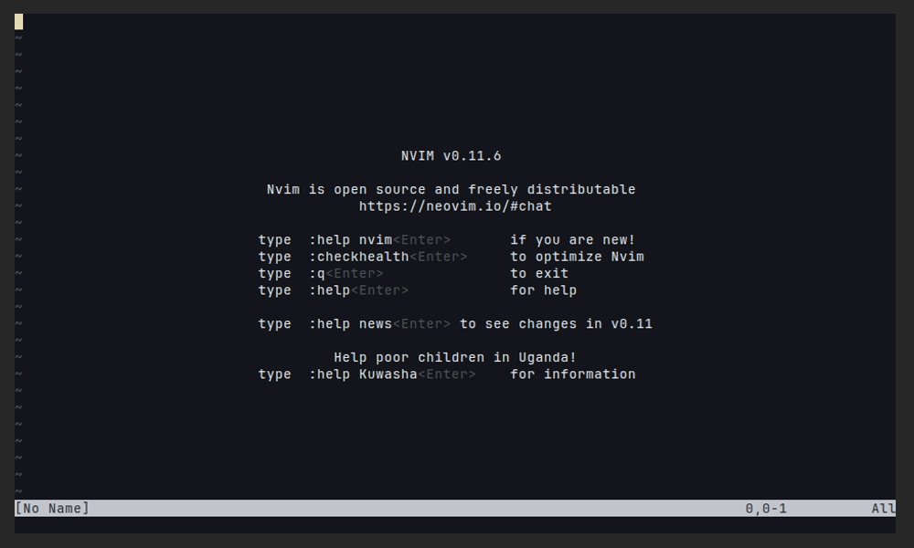

# camouflage.nvim

Hide sensitive values in configuration files during screen sharing.

A Neovim plugin that visually masks secrets in `.env`, `.json`, `.yaml`, `.toml`, `.properties`, `.netrc`, `.xml`, `.http`, **Terraform/HCL** (`.tf`, `.tfvars`, `.hcl`), and **Dockerfile** files using extmarks - **without modifying the actual file content**.

[](https://github.com/zeybek/camouflage.nvim/releases)
[](https://github.com/zeybek/camouflage.nvim/actions/workflows/ci.yml)
[](https://neovim.io)
[](LICENSE)
[](https://deepwiki.com/zeybek/camouflage.nvim)

## Demo



## Features

- **Multi-format support**: `.env`, `.json`, `.yaml`, `.yml`, `.toml`, `.properties`, `.ini`, `.conf`, `.sh`, `.netrc`, `.xml`, `.http`, `.tf`, `.tfvars`, `.hcl`, `Dockerfile`, `Containerfile`
- **Nested key support**: Handles `database.connection.password` in JSON/YAML/XML
- **All value types**: Masks strings, numbers, and booleans
- **Multiple styles**: `stars`, `dotted`, `text`, `scramble`
- **Reveal & Yank**: Temporarily reveal or copy masked values
- **Follow Cursor Mode**: Auto-reveal current line as you navigate
- **Workspace Audit**: Scan supported files into quickfix/location list without exposing values
- **Rule-Based Policy**: Data-only ignore/force-mask rules for paths, parsers, keys, metadata, and safe value shapes
- **Weak Secret Check**: Offline badges for obvious defaults, placeholders, short values, repeated values, and low-entropy tokens
- **Custom Check API**: Register trusted Lua checks that render through the shared badge pipeline
- **Have I Been Pwned**: Manually check passwords against the breach database (network checks are opt-in; Neovim 0.10+ with `vim.system`, plus `curl`)
- **JWT Expiry Hints**: Decode `exp` claim and show "expires in 2h" badges
- **Hot Reload**: Config changes apply immediately
- **Event System**: Hooks for extending functionality
- **TreeSitter Support**: Enhanced parsing for JSON/YAML/TOML/XML/HTTP/HCL/Dockerfile
- **Telescope/Snacks Integration**: Mask values in preview buffers
- **Zero file modification**: All masking is purely visual
- **Extensible**: Register custom parsers for unsupported formats via a public API
- **Programmable Checks**: Add local or async value checks with `register_check`

## Security Model

camouflage hides sensitive values **visually**, by drawing over them with
virtual text. It does **not** change the file, and it does **not** encrypt or
remove anything.

**It protects against** casual exposure of secrets on screen: shoulder-surfing,
screen sharing, pair programming, screenshots, and demos.

**It does not protect against** anything that reads the buffer or file contents
directly, because the real text is still there underneath the mask:

- search results and grep tools, including Telescope `live_grep` result lines
  (only the **preview** buffer is masked, not the matched result rows)
- LSP servers, completion sources, and AI assistants
- `:%print`, `:substitute` previews, `:w`/`:saveas`, and yanking with `yy`/`"+y`
- the `+`/`*` clipboard registers (use `:CamouflageYank`, which copies the real
  value deliberately with a confirm prompt and timed auto-clear)

For per-repo `.camouflage.yaml` files, masking config is applied as data only
(no code execution). If you don't trust the repositories you open, set
`project_config.secure = true` to gate the file behind Neovim's
`vim.secure`/`:trust` mechanism.

Have I Been Pwned checks use the network. They are manual/opt-in by default:
the `:CamouflagePwnedCheck*` commands remain available, but automatic checks on
buffer enter, save, or text change are disabled unless you set the corresponding
`pwned` option to `true`. The HIBP integration uses k-anonymity and sends only
the first 5 characters of a SHA-1 hash, but this is still a deliberate network
request.

The `scramble` style is **cosmetic, not protective**: the mask is a shuffle of
the real characters, so it leaks the value's length and character set.

## Installation

### [lazy.nvim](https://github.com/folke/lazy.nvim)

```lua
{
  'zeybek/camouflage.nvim',
  event = 'VeryLazy',
  opts = {},
  keys = {
    { '<leader>ct', '<cmd>CamouflageToggle<cr>', desc = 'Toggle Camouflage' },
    { '<leader>cr', '<cmd>CamouflageReveal<cr>', desc = 'Reveal Line' },
    { '<leader>cy', '<cmd>CamouflageYank<cr>', desc = 'Yank Value' },
    { '<leader>cf', '<cmd>CamouflageFollowCursor<cr>', desc = 'Follow Cursor' },
  },
}
```

<details>
<summary>Other package managers</summary>

#### [packer.nvim](https://github.com/wbthomason/packer.nvim)

```lua
use {
  'zeybek/camouflage.nvim',
  config = function()
    require('camouflage').setup()
  end
}
```

#### [vim-plug](https://github.com/junegunn/vim-plug)

```vim
Plug 'zeybek/camouflage.nvim'

" In your init.lua or after/plugin/camouflage.lua:
lua require('camouflage').setup()
```

#### [mini.deps](https://github.com/echasnovski/mini.deps)

```lua
local add = MiniDeps.add
add({
  source = 'zeybek/camouflage.nvim',
})
require('camouflage').setup()
```

#### Manual Installation

```bash
git clone https://github.com/zeybek/camouflage.nvim.git \
  ~/.local/share/nvim/site/pack/plugins/start/camouflage.nvim
```

Then add to your `init.lua`:

```lua
require('camouflage').setup()
```

</details>

## Configuration

The plugin works with zero configuration. Here's a quick overview of common options:

```lua
require('camouflage').setup({
  enabled = true,
  auto_enable = true,
  style = 'stars',           -- 'text' | 'dotted' | 'stars' | 'scramble'
  mask_char = '*',
  debounce_ms = 150,
  max_lines = 5000,

  audit = {
    ignore_patterns = { '.git/**', 'node_modules/**' },
    destination = 'quickfix', -- 'quickfix' | 'loclist'
  },

  policy = {
    enabled = true,
    default_action = 'mask',
    terminal_path_ignores = { 'node_modules/**', '.git/**' },
    rules = {
      {
        id = 'ignore-debug-flags',
        action = 'ignore',
        key = { '^DEBUG$', '^PORT$' },
        parser = { 'env', 'json', 'yaml' },
      },
      {
        id = 'force-client-secrets',
        action = 'mask',
        allow_force = true,
        key = { 'client[_%.%-]?secret', 'private[_%.%-]?key' },
      },
    },
  },

  checks = {
    weak_secret = {
      enabled = true,
      min_sensitive_length = 12,
      entropy_threshold = 3.0,
      ignored_key_patterns = {},
      ignored_value_patterns = {},
    },
  },

  pwned = {
    enabled = true,          -- Manual HIBP commands are available
    auto_check = false,      -- Network check on BufEnter (opt in)
    check_on_save = false,   -- Network check on BufWritePost (opt in)
    check_on_change = false, -- Network check on TextChanged (opt in)
  },

  reveal = {
    follow_cursor = false,   -- Auto-reveal current line
  },

  yank = {
    confirm = true,          -- Require confirmation before copying
    auto_clear_seconds = 30, -- Auto-clear clipboard
  },

  integrations = {
    telescope = true,
    cmp = { disable_in_masked = true },
  },
})
```

> **[Full configuration reference](https://github.com/zeybek/camouflage.nvim/wiki/Configuration)** on the wiki.

## Commands

| Command | Description |
|---------|-------------|
| `:CamouflageToggle` | Toggle camouflage on/off |
| `:CamouflageReveal` | Reveal masked values on current line |
| `:CamouflageYank` | Copy unmasked value at cursor to clipboard |
| `:CamouflageFollowCursor` | Toggle follow cursor mode |
| `:CamouflageStatus` | Show status and masked count |
| `:CamouflageRefresh` | Refresh decorations |
| `:CamouflageAudit [path]` | Scan workspace/path and populate quickfix |
| `:CamouflageAudit! [path]` | Scan workspace/path and populate location list |
| `:CamouflageWeakSecretToggle` | Toggle offline weak-secret badges |
| `:CamouflagePwnedCheck` | Check if value under cursor is pwned |
| `:CamouflagePwnedCheckLine` | Check all values on current line |
| `:CamouflagePwnedCheckBuffer` | Check all values in buffer |
| `:CamouflagePwnedClear` | Clear pwned indicators from buffer |
| `:CamouflagePwnedClearCache` | Clear local pwned check cache |
| `:CamouflageExpiryToggle` | Toggle JWT expiry check on/off |
| `:CamouflageInit` | Create `.camouflage.yaml` in project root |
| `:CamouflageParsers` | List registered parsers (debug) |

> **[Full commands list](https://github.com/zeybek/camouflage.nvim/wiki/Commands-and-Keymaps)** on the wiki.

## Workspace Audit

`:CamouflageAudit [path]` scans supported files under the current project root or optional path using the same parser registry as live masking. Results are written to quickfix by default; `:CamouflageAudit! [path]` writes to the current window's location list.

Audit results include file, line, column, parser, key, value length, and policy decision metadata, but never the plaintext value. The audit engine does not run HIBP or any other network check.

## Rule-Based Policy

`policy` lets you declare data-only rules in `setup()` or `.camouflage.yaml`.
Rules only filter values already found by supported parsers; a `mask` rule does
not make unsupported files parseable.

Policy precedence is deterministic:

1. `terminal_path_ignores` ignore a root-relative path first.
2. An `action = 'mask'` rule with `allow_force = true` can override that path
   ignore or a broader ordered ignore rule.
3. Otherwise, ordered rules are evaluated in order and the first match wins.
4. Unmatched variables use `default_action`, which defaults to `mask`.

Supported predicates are `path`, `basename`, `parser`, `key`, `nested`,
`commented`, `value_length`, `value_shape`, `value_prefix`, and `value_suffix`.
Value predicates never log or display the plaintext value.

Example `.camouflage.yaml`:

```yaml
version: 1
policy:
  terminal_path_ignores: ['tests/fixtures/**']
  rules:
    - id: ignore-debug
      action: ignore
      key: ['^DEBUG$', '^PORT$']
    - id: force-client-secrets
      action: mask
      allow_force: true
      key: ['client[_%.%-]?secret', 'private[_%.%-]?key']
```

## Weak Secret Check

The weak-secret check runs locally during masking and flags high-confidence weak values such as `password`, placeholders, repeated characters, short sensitive values, simple sequences, and low-entropy token-like strings. It uses key context, so benign values like `PORT=5432` are not treated like passwords.

Badges render through the same central badge pipeline as HIBP and JWT expiry. The result text and metadata include the reason, key, and value length, but never the plaintext value. Use `checks.weak_secret.ignored_key_patterns` or `checks.weak_secret.ignored_value_patterns` to suppress noisy project-specific cases.

## Custom Check API

Register trusted Lua checks to inspect parsed variables and render redacted badges through the same pipeline used by weak-secret, HIBP, and JWT expiry checks.

```lua
require('camouflage').register_check({
  name = 'local_policy',
  priority = 60,
  run = function(ctx)
    if ctx.var.key:match('TOKEN') and ctx.var.value == 'changeme' then
      return {
        severity = 'warning',
        text = '[policy]',
        hl_group = 'DiagnosticWarn',
        data = { reason = 'placeholder', key = ctx.var.key },
      }
    end
  end,
})
```

Checks receive plaintext values in `ctx.var.value`, so only register code you trust. Badge `text` and `data` should stay redacted; camouflage drops results that directly include the exact plaintext value.

Async checks must opt in with `async = true` and call `done(result)`. Old async completions are ignored after buffer edits, unregister, buffer deletion, or a newer decoration run.

```lua
require('camouflage').register_check({
  name = 'remote_policy',
  async = true,
  run = function(ctx, done)
    vim.defer_fn(function()
      done({ severity = 'info', text = '[checked]' })
    end, 10)
  end,
})
```

Configure registered checks with data under `checks.<name>`:

```lua
require('camouflage').setup({
  checks = {
    local_policy = {
      enabled = false,
      label = 'team',
    },
  },
})
```

Project config can set those data options but cannot register executable check code.

With `debug = true`, custom check logs include check names, run counts, failures, and elapsed time without logging plaintext values.

## Supported File Formats

| Format | Extensions | Nested Keys |
|--------|-----------|-------------|
| Environment | `.env`, `.env.*`, `.envrc`, `.sh` | No |
| JSON | `.json` | Yes |
| YAML | `.yaml`, `.yml` | Yes |
| TOML | `.toml` | Yes (sections) |
| Properties | `.properties`, `.ini`, `.conf`, `credentials` | Yes (sections) |
| Netrc | `.netrc`, `_netrc` | No |
| XML | `.xml` | Yes |
| HTTP | `.http` | No |
| HCL / Terraform | `.tf`, `.tfvars`, `.hcl` | Yes |
| Dockerfile | `Dockerfile`, `Containerfile`, `*.dockerfile` | No |

For unsupported formats, you can define [custom patterns](https://github.com/zeybek/camouflage.nvim/wiki/Custom-Patterns).
Runtime parser registrations with `file_patterns` are picked up by automatic masking immediately after registration.

When TreeSitter is available, JSON/YAML/XML nested keys are reported with their full path. XML attributes use `parent.path@attribute` so attributes and child elements with the same name stay distinct.

## Documentation

For detailed documentation, visit the **[Wiki](https://github.com/zeybek/camouflage.nvim/wiki)**:

- **[Getting Started](https://github.com/zeybek/camouflage.nvim/wiki/Getting-Started)** — Installation and first steps
- **[Configuration](https://github.com/zeybek/camouflage.nvim/wiki/Configuration)** — Full configuration reference
- **[Commands & Keymaps](https://github.com/zeybek/camouflage.nvim/wiki/Commands-and-Keymaps)** — All commands and suggested keybindings
- **[API Reference](https://github.com/zeybek/camouflage.nvim/wiki/API)** — Lua API for programmatic control
- **[Events & Hooks](https://github.com/zeybek/camouflage.nvim/wiki/Events-and-Hooks)** — Extend functionality with event listeners
- **[Have I Been Pwned](https://github.com/zeybek/camouflage.nvim/wiki/Have-I-Been-Pwned)** — Password breach checking
- **[Integrations](https://github.com/zeybek/camouflage.nvim/wiki/Integrations)** — Telescope, Snacks.nvim, nvim-cmp, Lualine
- **[Project Config](https://github.com/zeybek/camouflage.nvim/wiki/Project-Config)** — Repo-level `.camouflage.yaml`
- **[TreeSitter](https://github.com/zeybek/camouflage.nvim/wiki/TreeSitter)** — Custom TreeSitter queries
- **[Architecture](https://github.com/zeybek/camouflage.nvim/wiki/Architecture)** — Internal design and code flow
- **[Troubleshooting](https://github.com/zeybek/camouflage.nvim/wiki/Troubleshooting)** — Common issues and solutions

You can also use `:help camouflage` within Neovim.

## Also Available

- [Camouflage for VS Code](https://github.com/zeybek/camouflage) - The original VS Code extension

## License

MIT License - see [LICENSE](LICENSE) for details.
